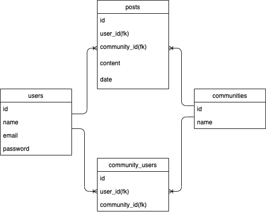
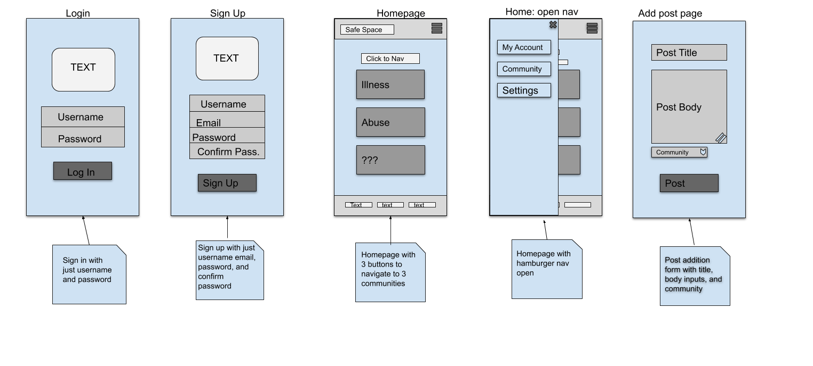

# Safe Space

Many people have had traumatic events occur in their life that lingers with them for years. Being unable to share how we feel, or not having the resources to do so with professionals, we risk having to deal with these experiences on our own. Survivor Network provides a platform for individuals seeking a safe community where they can share their feelings and experiences. A place that they can find relief and talk to those who can relate.

## Team

- **Product Owner**: Enmanuel de la Nuez
- **Scrum Master**: Devonte Duncan
- **Development Team Members**: Anne Hyacinthe, Cielo Raymundo

## Table of Contents

1. [Usage](#Usage)
1. [Requirements](#requirements)
1. [Development](#development)
   1. [Installing Dependencies](#installing-dependencies)
   1. [Tasks](#tasks)
1. [Team](#team)
1. [Contributing](#contributing)

## Usage

> Some usage instructions for getting the app up and running locally

## Requirements

- Node 0.10.x
- Axios 0.19.2.x
- Postgresql 9.1.x
- Express 4.17.1.x
- Dotenv 8.2.0.x
- PG 8.1.0.x

## Development

### Installing Dependencies

From within the root directory:

```sh
npm install
```

From within the `client` directory:

```sh
npm install
npm start
```

### Roadmap

View the project roadmap [here](https://github.com/safespace-marcy/safespace/projects).

## Contributing

See [CONTRIBUTING.md](CONTRIBUTING.md) for contribution guidelines.

## Style Guide

This project adheres to the [Eslint Guide](https://github.com/eslint/eslint) and [Prettier](https://github.com/prettier/prettier).

## Entity-Relationship Diagram



## Front-End Wireframe



### Respective Front-End Routes

- Login - `/` If logged out
- Sign Up - `/signup`
- Homepage - `/` If logged in
- Post Form - `/add-post`
